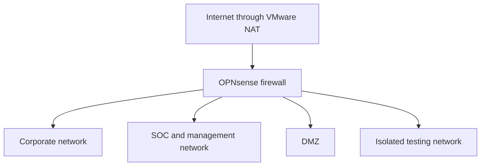

# Enterprise SOC Lab

**Status:** In progress — planning and architecture  

A simulated enterprise environment built with Windows and Linux virtual machines, self-hosted security tools, and documented security operations workflows.

This project follows the full lifecycle of building, securing, monitoring, investigating, and recovering an enterprise environment. The goal is to develop practical cybersecurity analyst skills and publish evidence of the work as each phase is completed.

> **Progress note:** The architecture, tools, exercises, and deliverables below describe the project roadmap. They do not represent completed implementations unless explicitly marked complete.

## Project Objectives

- Build a segmented enterprise network with corporate, SOC, DMZ, and isolated testing environments.
- Configure routing, firewall policies, NAT, DNS, DHCP, and domain services.
- Collect and analyze Windows, Linux, authentication, firewall, and network telemetry.
- Develop and tune detections for simulated suspicious activity.
- Investigate alerts through triage, evidence collection, containment, and recovery.
- Track security incidents and operational issues through a ticketing system.
- Implement encrypted backups and validate recovery through restore tests.
- Develop Python automation connecting security alerts to incident tickets.
- Publish reproducible documentation, investigation reports, and lessons learned.

## Progress Tracker

- [x] Create project repository
- [x] Define initial project scope and technology roadmap
- [ ] Assess host resources and finalize VM allocation
- [ ] Publish architecture and IP address plan
- [ ] Build virtual networks and firewall
- [ ] Configure Linux server foundations
- [ ] Configure domain services, DNS, and DHCP
- [ ] Configure endpoint logging
- [ ] Deploy Wazuh and validate log ingestion
- [ ] Develop and test custom detections
- [ ] Deploy Velociraptor and document a threat hunt
- [ ] Deploy Zabbix and GLPI
- [ ] Configure backups and validate recovery
- [ ] Implement email and file-access monitoring
- [ ] Complete six incident investigations
- [ ] Develop Python alert-to-ticket automation
- [ ] Publish response playbooks and final demonstration

## Planned Technology Stack

The core design prioritizes self-hosted tools without required cloud subscriptions. Windows endpoints will require an appropriate license or time-limited evaluation.

| Function | Planned Technology |
| --- | --- |
| Virtualization | VMware Workstation Pro |
| Firewall and routing | OPNsense Community |
| Server operating system | Ubuntu Server |
| Directory services | Samba Active Directory |
| DNS | Samba internal DNS |
| DHCP | OPNsense initially; Kea later |
| Windows endpoint telemetry | Sysmon, Windows auditing, PowerShell logs |
| Linux endpoint telemetry | auditd |
| SIEM and endpoint monitoring | Wazuh |
| Threat hunting and forensic collection | Velociraptor |
| Network intrusion detection | Suricata |
| Infrastructure monitoring | Zabbix |
| Incident ticketing and asset management | GLPI |
| Backup and recovery | Restic |
| File services and access auditing | Samba |
| Email services | Postfix |
| Spam and phishing analysis | Rspamd |
| Malware scanning | ClamAV |
| Packet analysis | Wireshark, tcpdump |
| Controlled security testing | Atomic Red Team, benign custom simulations |
| Automation | Python, Bash, PowerShell |

### Optional Extensions

These are outside the required core and will depend on hardware resources, licensing, and learning priorities.

- **Security Onion:** Additional network investigation using Zeek, Suricata, and packet captures.
- **OpenEDR:** Comparison with another endpoint security platform.
- **Windows Server Evaluation:** Comparison of Microsoft AD DS and Samba AD.
- **Veeam Community Edition:** Comparison of backup workflows.
- **Kali Linux:** Controlled testing from the isolated testing network.

## Planned Network Architecture

Four virtual networks will separate employee systems, security infrastructure, exposed services, and test systems.



| Network | Planned Subnet | Purpose |
| --- | --- | --- |
| Corporate | `10.10.10.0/24` | Windows/Linux endpoints, domain services, and internal file access |
| SOC and management | `10.10.20.0/24` | Security monitoring, investigations, ticketing, and backups |
| DMZ | `10.10.30.0/24` | Lab email services and optional web services |
| Isolated testing | `10.10.40.0/24` | Authorized simulations and controlled traffic generation |

### Planned Network Policies

- Corporate endpoints may access required services and send telemetry to the SOC.
- Regular corporate users may not access SOC administration interfaces.
- DMZ systems may not initiate unrestricted connections to internal networks.
- Testing-network traffic is denied by default and enabled only for specific exercises.
- Administrative access is restricted to designated management systems.
- Important allowed and denied connections are logged.
- Firewall policies are validated through connection tests and packet analysis.

The topology and VM allocation will be finalized after assessing host resources.

## Planned Virtual Machines

| Host | Role |
| --- | --- |
| `FW01` | OPNsense firewall, routing, NAT, and Suricata |
| `CORE01` | Samba AD, DNS, and later Kea DHCP |
| `WIN11-01` | Windows domain-joined endpoint |
| `LNX-01` | Linux endpoint |
| `SOC01` | Wazuh manager, indexer, and dashboard |
| `OPS01` | Zabbix and GLPI |
| `IR01` | Velociraptor server |
| `DMZ01` | Postfix, Rspamd, and ClamAV |
| `BACKUP01` | Restic backup repository |
| `KALI01` | Optional controlled testing system |
| `SO01` | Optional Security Onion deployment |

Not all virtual machines need to run simultaneously. Some services may initially share a VM to accommodate available memory and storage.

## Security Monitoring Design

### Endpoint Telemetry

**Windows**
- Sysmon process and network events
- Authentication events
- PowerShell logging
- Account and group changes
- Registry and persistence-related activity

**Linux**
- Authentication and privilege use
- Account and group changes
- Selected command execution
- Sensitive-file access and modification
- Service and configuration changes

### Wazuh

Planned uses include:

- Centralized security-event collection
- Authentication monitoring
- File-integrity monitoring
- Vulnerability detection
- Custom detection rules
- Alert triage and false-positive tuning
- MITRE ATT&CK mapping where applicable

### Velociraptor

Planned uses include:

- Endpoint artifact collection
- Process and network investigation
- Persistence hunting
- Filesystem searches
- Indicator searches across endpoints
- Incident-scoped forensic collection

### Suricata and Packet Analysis

Planned uses include:

- Network intrusion detection
- Review of suspicious connections
- Protocol and traffic analysis
- Correlation of network and endpoint evidence
- Validation of sensor visibility using known test traffic

## Implementation Roadmap

### Phase 0 — Planning and Baseline

**Planned work**
- Assess available CPU, memory, and storage.
- Define project scope and completion criteria.
- Establish naming conventions and an IP address plan.
- Design network boundaries and permitted traffic.
- Create an asset inventory and testing rules.

**Evidence**
- Architecture diagram
- IP address table
- VM inventory
- Threat model
- Project scope and limitations

### Phase 1 — Virtual Networking and Firewall

**Planned work**
- Create VMware virtual networks.
- Deploy OPNsense.
- Configure interfaces, routing, NAT, and segmentation.
- Implement and test firewall policies.
- Examine ARP, ICMP, TCP, UDP, DNS, and DHCP traffic.

**Evidence**
- Firewall policy explanations
- Allowed and denied connection tests
- Annotated packet captures
- Routing and connectivity troubleshooting notes

### Phase 2 — Linux Server Foundation

**Planned work**
- Deploy and configure Ubuntu Server systems.
- Configure administrative access, updates, and time synchronization.
- Practice users, groups, permissions, services, and logging.
- Establish baseline configurations for later services.

**Evidence**
- Server build notes
- Baseline configuration explanations
- Service troubleshooting examples

### Phase 3 — Identity, DNS, and DHCP

**Planned work**
- Deploy Samba as an Active Directory domain controller.
- Configure the internal domain `corp.tacitzero.test`.
- Create users, groups, organizational units, and service accounts.
- Configure DNS records and forwarding.
- Configure DHCP through OPNsense, then migrate corporate DHCP to Kea.
- Join the Windows endpoint to the domain.
- Test group-based access to shared resources.

**Evidence**
- Identity architecture
- DNS record table
- DHCP configuration and lease analysis
- Access-control matrix
- Domain and networking troubleshooting report

### Phase 4 — Windows and Linux Endpoint Logging

**Planned work**
- Install Sysmon and configure Windows auditing.
- Enable relevant PowerShell logs.
- Configure auditd on Linux.
- Enroll endpoints in Wazuh and Velociraptor as those services become available.
- Generate and identify baseline endpoint activity.

**Evidence**
- Endpoint logging matrix
- Configuration explanations
- Example process, authentication, and account-change events
- Baseline and false-positive notes

### Phase 5 — Wazuh SIEM and Detection Engineering

**Planned work**
- Deploy the Wazuh server components.
- Enroll Windows and Linux agents.
- Ingest firewall and authentication logs.
- Configure file-integrity monitoring.
- Develop and test custom detection rules.
- Investigate alerts and tune noisy detections.

**Planned detection exercises**
- Repeated failed logins
- New administrator accounts
- Suspicious PowerShell activity
- Sensitive-file modifications
- Unexpected service installation
- Privileged Linux activity
- Firewall deny spikes

**Evidence**
- Custom rules and configuration notes
- Detection test results
- Alert investigations
- False-positive analysis
- MITRE ATT&CK mappings where supported by evidence

### Phase 6 — Threat Hunting and Forensic Collection

**Planned work**
- Deploy Velociraptor and enroll clients.
- Define investigation questions and hunt hypotheses.
- Collect relevant endpoint artifacts.
- Investigate processes, connections, persistence, and recent execution.
- Document conclusions and collection limitations.

**Evidence**
- Hunt hypotheses
- Selected artifacts or VQL queries
- Sanitized evidence
- Investigation findings
- Containment recommendations

### Phase 7 — Monitoring, Ticketing, and Asset Management

**Planned work**
- Deploy Zabbix and GLPI.
- Monitor host availability, resources, and critical services.
- Build an asset inventory.
- Define ticket categories, priorities, and escalation procedures.
- Record operational failures and security incidents.

**Evidence**
- Monitoring dashboard examples
- Alert threshold explanations
- Operations and security tickets
- Incident priority matrix
- Escalation procedure

### Phase 8 — Backup and Recovery

**Planned work**
- Create an encrypted Restic repository.
- Define backup targets, schedules, and retention.
- Monitor backup results and run integrity checks.
- Restore deleted files and damaged configurations.
- Test recovery of selected service data.

**Evidence**
- Backup policy
- Recovery procedures
- Restore-test results
- Recovery-time measurements
- Failure and remediation notes

VM snapshots will support temporary rollback during exercises; they will not replace independent backups.

### Phase 9 — Email and File-Access Security

**Planned work**
- Deploy Postfix, Rspamd, and ClamAV.
- Generate controlled test messages.
- Analyze email authentication results and suspicious indicators.
- Integrate the Python phishing email analyzer where appropriate.
- Configure Samba file-access auditing.
- Investigate unauthorized access attempts and unusual file activity.

**Evidence**
- Email investigation examples
- Mail-security configuration explanations
- File-access investigations
- Permission analysis
- Detection and remediation notes

### Phase 10 — Optional Network Investigation Extension

**Planned work**
- Evaluate Security Onion if host resources permit.
- Verify which virtual-network traffic the sensor can observe.
- Investigate Zeek metadata, Suricata alerts, and packet captures.
- Correlate network evidence with endpoint events.

**Evidence**
- Sensor visibility tests
- Packet-analysis reports
- Correlated investigation timelines

### Phase 11 — Python Security Automation

**Planned work**
- Parse Wazuh alerts.
- Extract affected hosts, users, rules, severity, and timestamps.
- Map alert severity to ticket priority.
- Deduplicate repeated alerts.
- Create or update GLPI incidents.
- Record failures and support a dry-run mode.
- Keep credentials outside source code.

**Evidence**
- Alert-to-ticket automation code
- Setup and usage documentation
- Example sanitized input and output
- Test results and failure-handling notes

## Planned Incident Investigations

Each case will document the simulation, detection, triage, evidence, response, recovery, and lessons learned.

| Case | Scenario | Investigation Focus |
| --- | --- | --- |
| IR-001 | Repeated failed authentication | Authentication logs, source activity, account protection |
| IR-002 | Suspicious PowerShell activity | Process ancestry, command lines, PowerShell logs |
| IR-003 | Benign persistence simulation | Scheduled tasks or startup entries, removal verification |
| IR-004 | Controlled phishing message | Headers, authentication results, sender and attachment indicators |
| IR-005 | Unauthorized file access | User identity, permissions, access logs, file changes |
| IR-006 | Destructive change and recovery | Change detection, impact assessment, restoration, integrity validation |

### Investigation Report Structure

1. Summary and scope
2. Simulation steps
3. Initial alert or observation
4. Timeline and supporting evidence
5. Analyst reasoning
6. Containment and remediation
7. Recovery and validation
8. Detection improvements
9. Limitations and lessons learned

## Planned Repository Structure

Directories will be added as relevant work begins.

```text
enterprise-soc-lab/
├── README.md
├── architecture/
│   ├── network-diagram/
│   ├── ip-address-plan.md
│   ├── asset-inventory.md
│   └── threat-model.md
├── build-guides/
│   ├── opnsense.md
│   ├── samba-ad-dns.md
│   ├── kea-dhcp.md
│   ├── wazuh.md
│   ├── velociraptor.md
│   ├── zabbix-glpi.md
│   └── backups.md
├── detections/
│   ├── wazuh-rules/
│   ├── sysmon/
│   ├── linux-audit/
│   └── test-results/
├── incidents/
│   ├── IR-001-password-attack/
│   ├── IR-002-powershell/
│   ├── IR-003-persistence/
│   ├── IR-004-phishing/
│   ├── IR-005-data-access/
│   └── IR-006-recovery/
├── automation/
│   └── alert-to-ticket/
├── playbooks/
├── recovery/
└── screenshots/
```

## Target Portfolio Deliverables

- Documented network architecture
- Reproducible build guides with configuration reasoning
- Custom detection rules and validation results
- Six incident investigation reports
- Four incident-response playbooks
- Python alert-to-ticket automation
- Backup and restore report
- Selected, annotated screenshots
- Lab demonstration video
- Final lessons-learned report

## Documentation Standards

Published work will explain:

- What was configured or tested
- Why the configuration was chosen
- How the result was validated
- What failed and how it was resolved
- What limitations remain

Progress updates will distinguish planned work from implemented and validated capabilities. Screenshots and logs will support the analysis rather than replace it.

## Testing Boundaries

All simulations will be limited to systems owned or explicitly authorized for this lab. Testing networks will be isolated by default, and exercises will use benign simulations where possible.

Published artifacts will exclude credentials, API keys, personal data, VM images, and malware samples.
